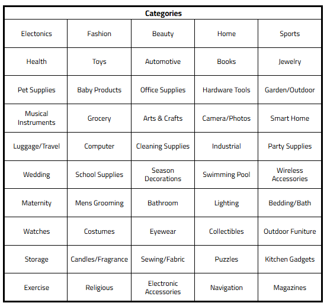

# Khayre Ali

**MS Computer Science @ Northeastern University**

[LinkedIn](https://linkedin.com/in/khayreali/) | [GitHub](https://github.com/khayreali)

---

## Projects

<table>
<tr>
<td width="300">

</td>
<td>

  #### Vision Transformer for Product Categorization
  **Skills:** *Python, PyTorch, BeautifulSoup, Transformers, Scikit-learn*
  Product categorization pipeline using Vision Transformer fine-tuning on 12,500+ scraped Amazon images, optimized through parameter freezing techniques.
  
</td>
</tr>
</table>

---

### NeurIPS 2025 - Open Polymer Prediction

**Skills:** `Python` `PyTorch` `XGBoost` `Scikit-learn` `Pandas` `NumPy`

---

### 🛡️ Multi-Modal Content Safety Classifier

**Skills:** `Python` `PyTorch` `Transformers` `LLaVA` `CLIP` `Streamlit`

---
