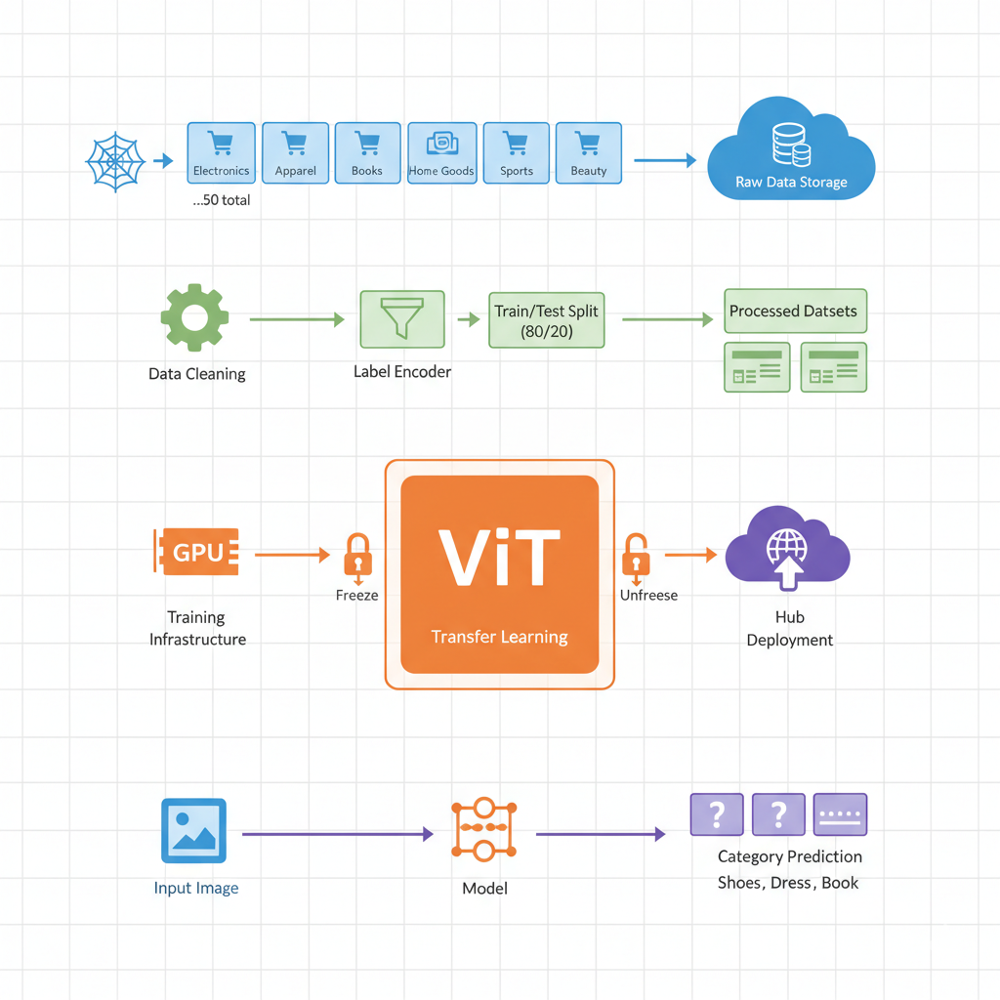
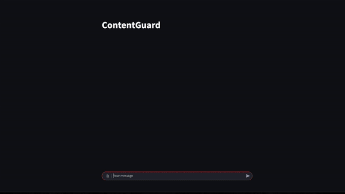

# Khayre Ali

**MS Computer Science @ Northeastern University**

[LinkedIn](https://linkedin.com/in/khayreali/) | [GitHub](https://github.com/khayreali)

## Projects

<table>
<tr>
<td width="200">

</td>
<td>
  #### [Vision Transformer for E-commerce Product Categorization](https://github.com/khayreali/ecommerce-product-classifier)
  `Python`, `PyTorch`, `BeautifulSoup`, `Transformers`, `Scikit-learn`
  
  Product categorization pipeline using Vision Transformer fine-tuning on 12,500+ scraped e-commerce images, optimized through parameter freezing techniques.
  
</td>
</tr>

<tr>
<td width="200">

</td>
<td>

  #### [NeurIPS 2025 - Open Polymer Prediction](https://github.com/khayreali/neurips_open_polymer_prediction_2025)
  `Python` `PyTorch` `XGBoost` `Scikit-learn` `RDKit` `PyTorch Geometric` `Mordred` `Graph Neural Networks`
  
  Hybrid ML pipeline combining tree-based models with Graph Neural Networks to predict 5 polymer physical properties from SMILES representations, achieving top 13% NeurIPS competition ranking.
  
</td>
</tr>

<tr>
<td width="200">

</td>
<td>

  #### [Multi-Modal Content Safety Classifier](https://github.com/khayreali/content-guard)
  `Python` `PyTorch` `Transformers` `BERT` `BART` `CLIP` `LLaVA` `EasyOCR` `Streamlit`
  
  Multi-modal content safety system using 6 ML models (BERT, CLIP, LLaVA) to detect harmful content in text/images with real-time chain-of-thought reasoning.
  
</td>
</tr>

</table>
